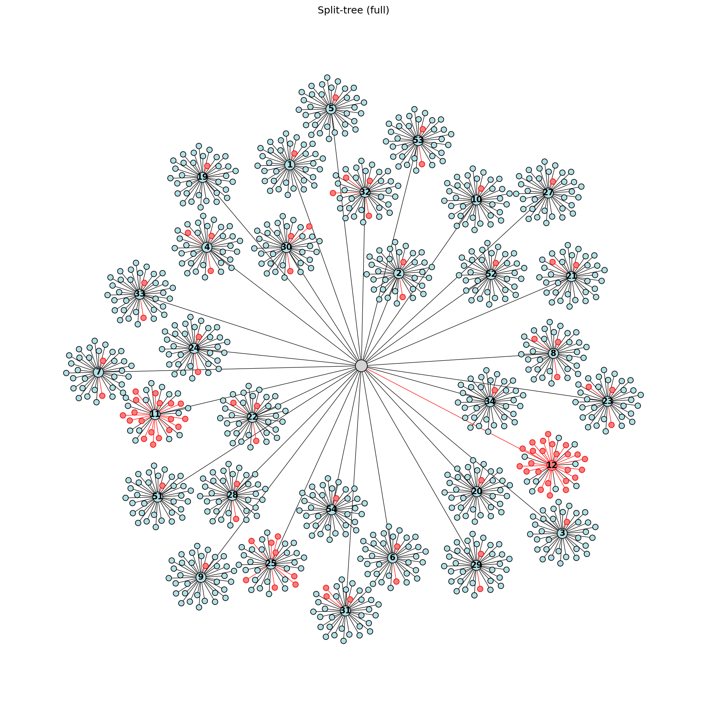

# LC-Seq



Python and rust-based program for analyzing LC-seq chromatographic data from DNA-encoded libraries.

**Platform:** Windows (primary). Python 3.10+ recommended for development (Rust extension).

---

## Install (Windows executable)

**Recommended for most users:** download **`LC-Seq-v2.0.1-windows.zip`** from [GitHub Releases](https://github.com/brodohfasho/LC-Seq/releases), extract the whole `LC-Seq` folder, and run `LC-Seq.exe`. No Python or Rust install required — pedigree and lineage analysis are included in the zip.

Step-by-step instructions: **[dev/INSTALL.md](dev/INSTALL.md)**.

---

## Quick start (from source)

```bash
git clone https://github.com/brodohfasho/LC-Seq.git
cd LC-Seq
python -m venv venv
venv\Scripts\activate
pip install -r requirements.txt
python -m src.main
```

(Or `python src/main.py` from the repo root.)

**Pedigree and lineage analysis** require the Rust `lcseq` extension — see **[dev/DEVELOPER_SETUP.md](dev/DEVELOPER_SETUP.md)** (`maturin develop` in `LC-Seq-New-master/`). Peak picking works with a Python fallback when Rust is not built.

On Linux/macOS, use `source venv/bin/activate` instead of `venv\Scripts\activate`.

---

## LC-Seq Chromatographic Data Analysis for DNA-Encoded Libraries
This program will process and analyze chromatographic data collected from LC-Seq experiments. Users must provide a spreadsheet where each row refers to a compound and chromatographic data is delimited (e.g. time;count, etc.) and contained in a single cell.

After spreadsheet configuration and database construction, the application contains two primary modules:

1. Chromatogram Visualizer: Visualize LC-seq chromatograms for each library member. Smart search functions and ID-based lookup supported. Contains peak picking, integrations, and full null-truncation lineage analysis and product ID. Primarily useful for analyzing specific compounds (top hits from affinity selections) or compound series (e.g. compare RT differences for related macrocyclic peptide scaffolds).

2. Library Analysis: Calculate and visualize CQ metrics to assess signal-to-noise and library spread across fractions. Calculate retention times for individual library members through null-informed Pedigree analysis. Visualize per-cycle trends in synthesis via split-tree visualization. Export data package including RT assignments and more.

---

## Basic workflow

### Core (all libraries)

1. **Load Spreadsheet** — CSV or Excel file.
2. **Configure Spreadsheet** — compound ID, chromatogram column, delimiters, time/count fields, metadata columns. Save named presets for reuse.
3. **Create / Load database** — under `output/databases/`:
   - **Index database** — metadata + raw chromatogram text; smaller; parses on plot.
   - **Full database** — all time/count points stored; larger; fastest repeat plotting.
4. **Chromatogram Visualizer** — compound list or metadata **Search**, overlay plots, **Peak Analysis** (modern or old-school picker), export plots (PNG/PDF/SVG).

### DEL library analysis (optional)

5. **Configure DEL fields** — BB1…BBn columns, null token, cycle count; optional **BB index CSV** for display indices; validate and accept configuration.
6. **Library Analysis** — library scan (signal quality, metrics, fraction plots); session cache under `output/library_data/`.
7. **Pedigree** — run null-truncation analysis (Pedigree RT assignment mode); tier slider; export CSV and pedigree figure (Graphviz or matplotlib fallback).
8. **Lineage** — per-class diagnostic plots for selected nodes.
9. **Split-tree** — combinatorial tree with pass-rate coloring; full-tree and BB1 branch views (after Pedigree or Direct pick RT assignment).
10. **Export analysis bundle** — folder with products CSV, audit metadata, summary/flagged building blocks, `grids/` Excel files, optional prominence CSV and PDF report.

The status line on the main window reflects load/configure/database state.

---

## Data file requirements

| Item | Requirement |
|------|-------------|
| **Formats** | `.csv`, `.xlsx`, `.xls` |
| **Layout** | One row per compound (or per variant if you configure a variant column). |
| **Compound ID** | Single column with a unique identifier per row (or per primary+variant pair). |
| **Chromatogram data** | One column containing encoded time/count series as text, split by delimiters you define in Configure Spreadsheet. |
| **Metadata** | Optional additional columns; choose which to index for search. |
| **DEL pedigree** | BB1…BBn columns (coupling order), null token, and cycle count in Configure Spreadsheet. |
| **BB index (optional)** | UTF-8 or Excel CSV mapping building-block names to display indices. |
| **Variants** | Optional variant column (e.g. linear vs cyclized) for multiple rows sharing one library ID. |

Delimiter and column mapping are data-specific—use **Configure Spreadsheet** preview to confirm parsing before building a database. Very large sheets are supported via chunked processing for full database builds.

---

## System notes

| Component | Release zip users | Source / dev installs |
|-----------|-------------------|------------------------|
| Windows 10/11 x64 | Yes | Yes |
| Rust toolchain | **Not needed** (bundled) | Needed once to `maturin develop` |
| Graphviz (`dot` on PATH) | Optional — better pedigree split-tree layout | Optional |
| Python + scipy | Not needed | Dev only — Python fallback peak picker |

---

## Contact

**Grant Koch** grantkoch2319@gmail.com — questions, bugs, or feature requests:

---

## License

MIT — see [LICENSE](LICENSE).

---