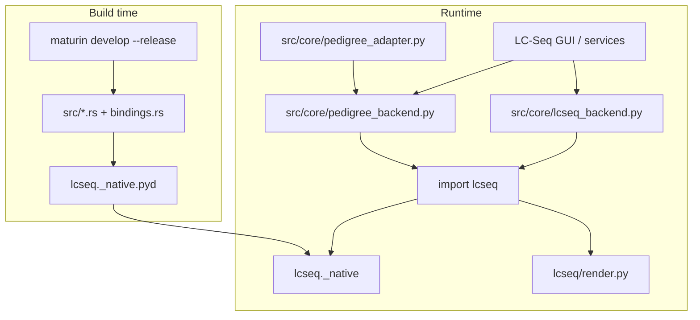

# LC-Seq-New-master: Rust engine integration guide

**Purpose:** Document how the `LC-Seq-New-master` crate integrates with the main LC-Seq application (peak picking, pedigree, lineage, and related rendering).

**Last updated:** 2026-07-16

---

## Executive summary

`LC-Seq-New-master` is **not** called as loose scripts or `.rs` source at runtime. It is compiled with **maturin + PyO3** into a Python package named `lcseq` (native module `lcseq._native`). The main app imports that package through thin wrappers in `src/core/`.

The Rust engine answers:

> Given replicated chromatograms for every positional truncate in a combinatorial DEL library, which building-block additions produce real, chromatographically consistent peaks as we walk from the all-null root toward full compounds?

**Integrated in LC-Seq today:** peak picking (optional Rust), pedigree evaluation, lineage class diagnostics, pedigree figure rendering (Graphviz).

**Not from this folder:** Combinatorial **Split-tree** build/plot/export (`src/core/del_cycle_tree/`), spreadsheet/DB ingestion, GUI, library scan metrics.

---

## How the wiring works



1. **Build:** `maturin develop --release` in `LC-Seq-New-master/` compiles Rust into `lcseq._native` and installs `python/lcseq/` into the repo venv.
2. **Data adapter:** `pedigree_adapter.py` maps SQLite compounds + `SpreadsheetConfig` BB columns into the dict/tuple shape Rust expects (N→C position tuples as keys).
3. **Wrappers:** `lcseq_backend.py` and `pedigree_backend.py` convert native results into app models and handle Python fallback when the extension is missing or fails parity check.

See [dev/DEVELOPER_SETUP.md](DEVELOPER_SETUP.md) for build steps and troubleshooting.

---

## Folder layout (what to keep)

### Required — build + runtime

| Path | Role |
|------|------|
| `src/` | Rust: peaks, consensus, pedigree DAG, PyO3 bindings |
| `Cargo.toml`, `Cargo.lock`, `pyproject.toml` | Build configuration |
| `python/lcseq/__init__.py` | Public exports |
| `python/lcseq/render.py` | Graphviz pedigree split-tree (`twopi` layout) |

### Dev / quality — keep in git, not in end-user zip

| Path | Role |
|------|------|
| `tests/*.rs` | Rust unit + integration tests |
| `tests/fixtures/real_sample.json` | Small real-data fixture |
| `python/tests/test_bindings.py` | PyO3 round-trip |
| `python/tests/test_render.py` | Tree rendering |
| `scripts/extract_real_fixture.py` | Regenerate fixture from master xlsx |

The Windows release zip (`dist/LC-Seq/`) contains only the PyInstaller bundle. It may include the **installed** `lcseq` extension and `render.py` if traced by PyInstaller — not the full `LC-Seq-New-master/` source tree.

### Archived — not used by the main app

Moved to [dev/archive/lcseq-standalone/](archive/lcseq-standalone/):

| Former path | Why archived |
|-------------|--------------|
| `python/lcseq/io.py` | Fixed-schema LDEL xlsx loader; app uses DB + `pedigree_adapter` |
| `python/lcseq/cli.py` | Standalone CLI pipeline |
| `python/lcseq/debug.py` | Archived matplotlib debug plots |
| `python/lcseq/lcseq.pdb` | Debug symbol artifact |
| Standalone `README.md`, `uv.lock` | Historical standalone workflow (see `dev/archive/`) |

---

## Rust API surface (`lcseq._native`)

Exported from `src/bindings.rs` via `python/lcseq/__init__.py`:

| Python API | Rust responsibility | LC-Seq usage |
|------------|---------------------|--------------|
| **`find_peaks(rt, intensity, alpha)`** | Modern NB-significance peak picker (baseline, prominence, area, p-values) | Peak Analysis panel, library signal quality, DEL direct-pick RT assignment |
| **`evaluate_library(...)`** | Build pedigree → pick peaks per replicate → score test + Bayesian consensus → pass/fail per node | Pedigree analysis, lineage cache |
| **`diagnose_class(...)`** | Single equivalence-class consensus with full diagnostic intermediates | Lineage analysis plots |
| **`NodeRecord`** | Per-node pedigree outcome (tier, pass/fail, chosen RT, score-test stats, etc.) | Pedigree export, tree rendering, DEL inputs |
| **`ClassDiagnostic`** | `diagnose_class` result type | Lineage UI |
| **`PyPeak`** | Single picked peak | Peak overlays |
| **`_hello()`** | Extension load sanity check | Dev only |

### `evaluate_library` parameters (kernel input)

| Parameter | Meaning |
|-----------|---------|
| `bbs_per_position` | Allowed BB names per position, **N→C order** |
| `null_token` | Empty-position token (e.g. `AgxNull`) |
| `chromatograms` | `dict[tuple[str,...], (rt ndarray, intensity ndarray)]` |
| `tolerance` | ±RT window for replicate agreement (same unit as RT arrays) |
| `alpha` | Per-peak FDR threshold for NB significance |
| `min_prominence`, `min_pct_area` | Optional peak quality filters |
| `peak_picking_algorithm` | `"modern"` or `"old_school"` (+ Gaussian params) |

### Pure Python in active package

| API | File | LC-Seq usage |
|-----|------|--------------|
| **`render_pruned_tree(records, out_path, ...)`** | `python/lcseq/render.py` | Pedigree split-tree PNG/SVG/PDF via Graphviz (`src/core/pedigree_render.py`) |

Tree rendering is **not** Rust. Without Graphviz, the app falls back to matplotlib tier-ring preview in `pedigree_render.py`.

---

## LC-Seq wrapper map

| App module | Calls | Feature |
|------------|-------|---------|
| `src/core/lcseq_backend.py` | `lcseq.find_peaks` | Modern peak picking; Python mirror when Rust missing |
| `src/core/pedigree_backend.py` | `lcseq.evaluate_library`, `lcseq.diagnose_class` | Pedigree + lineage (**Rust required**) |
| `src/core/pedigree_adapter.py` | (prepares inputs) | Spreadsheet BB columns → N→C chromatogram keys |
| `src/core/pedigree_service.py` | via `pedigree_backend` | Full-library pedigree run |
| `src/core/lineage_service.py` | via `pedigree_backend` | Per-class / tier diagnostics |
| `src/core/lineage_render.py` | `diagnose_class` + `find_peaks` | Lineage matplotlib figures |
| `src/core/pedigree_render.py` | `lcseq.render.render_pruned_tree` | Graphviz split tree |
| `src/core/peak_analysis_service.py` | `find_peaks_for_settings` | Single-compound peak pick |
| `src/core/library_signal_quality.py` | `find_peaks` | Scan-time SNR / peak stats |
| `src/core/del_cycle_tree/service.py` | `find_peaks_for_settings` only | Product RT for direct-pick mode |

### Python fallbacks (no Rust)

| Capability | Fallback module |
|------------|-----------------|
| Modern peak picking | `src/core/peak_picker_python.py` |
| Old-school Gaussian picking | `src/core/peak_picker_gaussian.py` (scipy) |
| Pedigree / lineage consensus | **None** — Rust required |

On startup, `lcseq_backend` runs a **parity probe**; stale `.pyd` builds automatically fall back to Python peak picking.

---

## Rust internal modules (reference)

```
src/
├── bindings.rs          # PyO3 exports
├── peaks/
│   ├── picker.rs        # Modern NB peak pipeline
│   ├── gaussian.rs      # Old-school Gaussian picker (pedigree path)
│   ├── baseline.rs      # Sigma-clipped NB baseline
│   ├── significance.rs  # NB/Poisson p-values
│   └── quality.rs       # Prominence / %area filters
├── evaluate/
│   ├── consensus.rs     # Multi-rep score test + Bayesian pick
│   ├── peak_model.rs    # Joint NB score test fitting
│   └── pedigree_eval.rs # Tier-by-tier walk + parent gating + pruning
└── library/
    ├── truncate.rs      # Positional truncate + equivalence class
    └── pedigree.rs      # DAG builder (classes + compounds)
```

### Algorithm flow (`evaluate_library`)

1. **`build_pedigree`** — Cartesian product of `(allowed BBs ∪ null)` per position; wire parent/child edges by dropping one non-null BB.
2. **Per replicate** — `pick_peaks_with_quality` (modern or old-school).
3. **Per class node** — `consensus`: earliest / most-significant / democratic picks → score test MLE → Bayesian MAP RT.
4. **Gating** — Child peaks must exceed parent threshold + tolerance (structural + cassette monotonicity).
5. **Pruning** — Descendants of failed nodes are not evaluated.

---

## What the main app adds (not in Rust crate)

| Feature | Location |
|---------|----------|
| Configure Spreadsheet, BB columns, null token | `src/models/spreadsheet_config.py` |
| SQLite library + scan cache | `src/core/library_metrics.py` |
| Split-tree visualization, verification, export bundle | `src/core/del_cycle_tree/` |
| Library Analysis UI | `src/ui/library_data_window.py` |
| In-app help | `src/help/*.md` |

Split-tree analysis reimplements notebook logic in Python. It only **borrows** peak picking from `lcseq_backend` when assigning product RTs via direct pick.

---

## Build, test, and release

### Developer build

```powershell
cd LC-Seq-New-master
..\venv\Scripts\maturin.exe develop --release
..\venv\Scripts\python.exe -m pytest ..\tests\test_lcseq_backend_parity.py -q
..\venv\Scripts\python.exe -m pytest python/tests -q
cargo test
```

### Feature requirements

| Workflow | Rust required? |
|----------|----------------|
| Visualizer + peak pick | Optional (Python fallback) |
| Library scan / signal quality | Optional |
| **Pedigree analysis** | **Yes** |
| **Lineage diagnostics** | **Yes** |
| Split-tree + export | No (peak pick inside optional) |
| Pedigree split-tree (Graphviz) | No Rust for render; needs `dot` on PATH |

### Release packaging

- End-user zip: `scripts/build_windows.ps1` → `scripts/package_release.ps1` (PyInstaller output only).
- Dev docs (`dev/archive/`, `dev/AGENT_INSTRUCTIONS.md`, this file) stay in the git repo, not the release zip.

---

## Glossary

| Term | Definition |
|------|------------|
| **Truncate** | Positional partial compound with nulls at unfilled sites |
| **Equivalence class** | Truncates sharing the same ordered non-null BB sequence (replicates differ by null padding) |
| **Pedigree** | DAG from root → tier classes → full compounds |
| **Vote floor** | Minimum RT for child peaks (`effective_threshold + tolerance`) |
| **Score test** | Rao test for shared peak position across replicates |
| **Bayesian pick** | MAP RT combining score-test prior and per-rep votes |
| **Pruning** | Skipping evaluation when a parent node failed |
| **Sequencing failure** | No NB-significant peaks in any replicate |
| **Synthesis failure** | Signal exists but no peak past parent threshold |

---

## Related docs

- [DEVELOPER_SETUP.md](DEVELOPER_SETUP.md) — maturin build, parity check, Graphviz
- [dev/archive/lcseq-standalone/](archive/lcseq-standalone/) — archived xlsx loader + CLI
- [dev/archive/INTEGRATION_PLAN_LCSEQ_ANALYSIS.md](archive/INTEGRATION_PLAN_LCSEQ_ANALYSIS.md) — historical phase plan (mostly complete)
- In-app: `src/help/pedigree_analysis.md`, `src/help/lineage_analysis.md`, `src/help/peak_picking.md`
