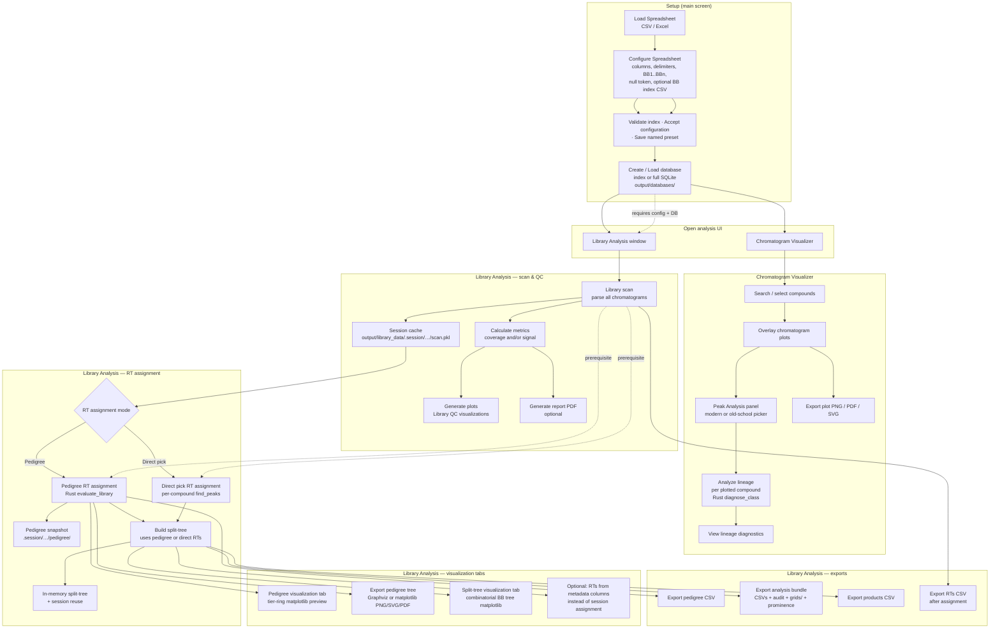
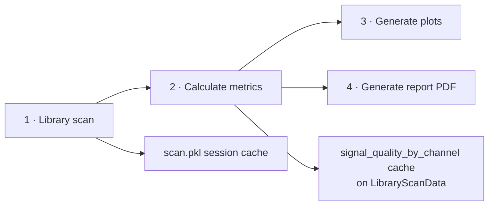
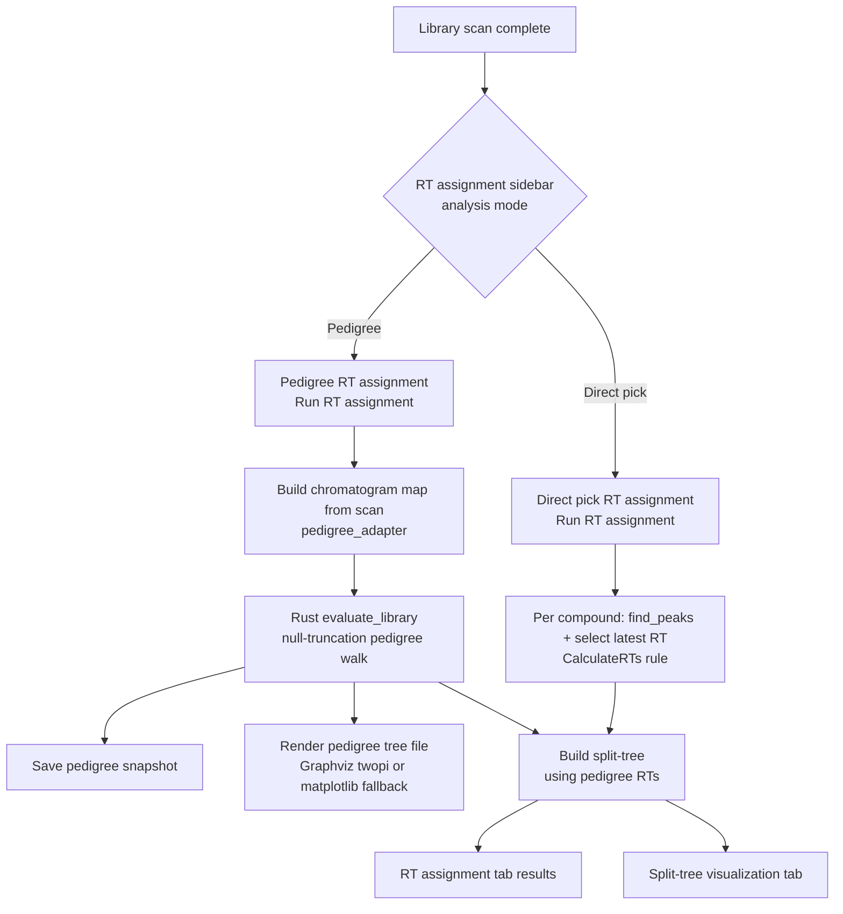

# LC-Seq application workflow

End-to-end map of major features, data dependencies, and core code paths. Use this when onboarding, planning performance work, or writing release QA scripts.

**Vocabulary:** Library Analysis · RT modes **Pedigree** / **Direct pick** · **Pedigree visualization** / **Split-tree visualization** · **Export analysis bundle**. Paper Methods used **Old-school** picking + **Direct pick**; Modern and Pedigree are later improvements.

**Legend:** solid arrows = typical user order; dashed arrows = optional branch or reuse of cached data.

### Viewing the flowcharts

| Where you open this file | Diagrams |
|--------------------------|----------|
| **GitHub** (repo browser or PR) | Mermaid blocks below render as graphics |
| **Cursor / VS Code preview** | Mermaid usually shows as a plain code block unless you install a Mermaid preview extension |
| **Any editor** | Use the **ASCII diagrams** in each section — they mirror the Mermaid charts |

Recommended extensions (optional): *Markdown Preview Mermaid Support* for VS Code/Cursor.

---

## 1. Full program flow (main window → analysis)



<details>
<summary>ASCII equivalent (section 1)</summary>

```
[Load Spreadsheet] → [Configure Spreadsheet] → [Accept config / save preset]
        → [Create or Load database]
        → ┬→ [Chromatogram Visualizer] → search → plot → peak analysis → lineage / export plot
          └→ [Library Analysis]
                → [Library scan] → scan.pkl cache
                → [Calculate metrics] → [Generate plots] → [Report PDF optional]
                → RT mode ─┬→ Pedigree (Rust evaluate_library) → pedigree snapshot
                           │       → pedigree viz tab · export tree · pedigree CSV
                           └→ Direct pick (find_peaks per compound)
                                   → [Build split-tree]
                                   → RT assignment tab · Split-tree tab
                                   → export analysis bundle · products CSV · RTs CSV
```

</details>

---

## 2. Setup phase (main screen)

| Step | UI | What happens | Output / cache |
|------|-----|--------------|----------------|
| Load Spreadsheet | Main → **Load Spreadsheet** | Read CSV/XLSX; optional sheet pick | DataFrame in memory (`AppState`) |
| Configure Spreadsheet | Main → **Configure Spreadsheet** | Map compound ID, chromatogram column, delimiters, time/count indices, metadata; DEL: BB columns, null token, cycle count; optional BB index CSV validate + accept | `SpreadsheetConfig` saved to `config/` |
| Create / Load database | Main → **Create / Load database** | **Index DB:** metadata + raw chromatogram text. **Full DB:** all parsed points stored | `output/databases/*.db` |
| Open visualizer | **Chromatogram Visualizer** (enabled after config + DB) | Compound search, overlay plots | Uses DB only |
| Open library analysis | **Library Analysis** (enabled after config + DB) | Dashboard for scan, RT assignment, split-tree / pedigree exports | Uses DB + config |

**Core modules:** `src/ui/main_screen.py`, `src/ui/configure_spreadsheet_dialog.py`, `src/ui/process_data_dialog.py`, `src/core/spreadsheet_loader.py`, `src/core/data_store.py`

---

## 3. Chromatogram Visualizer

| Step | UI | What happens | Engine |
|------|-----|--------------|--------|
| Search / plot | Compound table or metadata search | Load rows from SQLite; parse chromatogram if index DB | `DataProcessor` |
| Peak Analysis | Right panel → pick peaks | Single- or multi-compound peak pick + integration bounds | `peak_analysis_service` → `lcseq_backend` (Rust or Python fallback) |
| Analyze lineage | Peak panel → **Analyze lineage** | Per plotted compound: class diagnostics along pedigree ancestors | **Rust** `diagnose_class` via `lineage_service` |
| View lineage | Peak panel → **View lineage** | Matplotlib diagnostic figure for cached lineage | `lineage_render` |
| Export plot | Plot toolbar | PNG / PDF / SVG | matplotlib |

**Prerequisites:** BB columns configured for lineage. **Rust required** for lineage (not for basic peak pick).

**Core modules:** `src/ui/chromatogram_visualizer_window.py`, `src/ui/peak_analysis_panel.py`, `src/core/peak_analysis_service.py`, `src/core/lineage_service.py`

---

## 4. Library Analysis — scan & QC pipeline

This is the **library-wide** path (all compounds), separate from single-compound work in the Visualizer.



<details>
<summary>ASCII equivalent (section 4)</summary>

```
[1 Library scan] ──→ [scan.pkl session cache]
       │
       ├──→ [2 Calculate metrics] ──→ [signal_quality cache on scan object]
       │           ├──→ [3 Generate plots]
       │           └──→ [4 Generate report PDF]
```

</details>

| Step | UI (top bar / tabs) | What happens | Dominant cost | Progress / cancel |
|------|---------------------|--------------|---------------|-------------------|
| **1 · Library scan** | **Run library scan** | For each compound: load from DB; index DB parses raw chromatogram text; store sorted time/count arrays per channel | **High** on index DBs (parse × N) | Background worker; cancel on progress ticks |
| **2 · Calculate metrics** | **Calculate metrics** → Metrics tab | Coverage metrics: aggregate scan only. **Signal metrics:** per-entry peak pick × channels, then library means | **High** when signal metrics selected | Same; skips peak work if signal cache hit |
| **3 · Generate plots** | **Generate plots** → Plots tab | Coverage plots: fast. Signal plots: ensure signal cache, render matplotlib PNGs to session folder | Signal plots: peak pick if not cached | Same |
| **4 · Generate report** | **Generate report…** | PDF combining metrics, plots, optional pedigree/DEL sections | Depends on artifacts captured | Dialog-driven |

**Session cache:** `output/library_data/.session/{db_stem}/scan.pkl` — avoids re-parsing on reload.

**Core modules:** `src/ui/library_data_window.py`, `src/core/library_metrics.py`, `src/core/library_signal_quality.py`, `src/core/library_plots.py`, `src/core/library_metrics_store.py`

---

## 5. Library Analysis — RT assignment (pedigree vs direct pick)

Both modes require **library scan** (or chromatograms loaded while building the split-tree from the DB). BB columns must be configured.

**Paper Methods:** **Old-school** peak picking + **Direct pick** RT assignment. **Modern** picking and **Pedigree** mode were added after submission.



<details>
<summary>ASCII equivalent (section 5)</summary>

```
[Library scan complete]
        │
        ▼
   RT assignment mode? ── Pedigree ──→ pedigree_adapter → Rust evaluate_library
        │                                    ├→ save pedigree snapshot
        │                                    ├→ render pedigree tree file (Graphviz / matplotlib)
        │                                    └→ build split-tree (pedigree RTs)
        │
        └── Direct pick ──→ find_peaks per compound → latest RT (CalculateRTs rule)
                                    └→ build split-tree (direct RTs)
                                                │
                        ┌───────────────────────┴───────────────────────┐
                        ▼                                               ▼
              [RT assignment tab]                          [Split-tree visualization tab]
```

</details>

| Mode | UI | What happens | Engine |
|------|-----|--------------|--------|
| **Pedigree RT assignment** | RT assignment sidebar → mode **Pedigree** → **Run RT assignment** | Full-library null-truncation analysis; pass/fail per pedigree node; chosen RT per class/compound | **Rust** `evaluate_library` (`pedigree_service`) |
| **Direct pick RT assignment** | Mode **Direct pick** → **Run RT assignment** | Each full compound: peak pick on its chromatogram; product RT = latest accepted peak | `find_peaks_for_settings` (Rust or Python) + `select_direct_pick_product_rt` |
| **Split-tree build** | Runs as part of RT assignment (both modes) | Combinatorial split-tree from assignments; null-RT verification; pass-rate coloring inputs | Python `del_cycle_tree/service.py` |

**After pedigree run:** Pedigree CSV export, tier slider on **Pedigree visualization** tab, tree PNG/SVG/PDF export, and the split-tree can consume pedigree RTs.

**Core modules:** `src/core/pedigree_service.py`, `src/core/pedigree_adapter.py`, `src/core/pedigree_backend.py`, `src/core/del_cycle_tree/service.py`

---

## 6. Library Analysis — visualization tabs

| Tab | Shows | Data source | Render path |
|-----|--------|-------------|-------------|
| **Library QC metrics** | Aggregated metric cards | Snapshot from metrics step | UI labels |
| **Library QC visualizations** | Histogram / signal QC PNGs | Plot generation step | Session plot PNGs |
| **RT assignment** | Split-tree assignment table / summary after RT run | `DelCycleTreeData` | Tables in UI |
| **Pedigree visualization** | Null-truncation **pedigree** tier-ring preview, tier slider, pass/fail colors | `PedigreeAnalysisResult` (pedigree mode only) | `pedigree_render.build_pedigree_tree_preview_figure` (matplotlib) |
| **Split-tree visualization** | Combinatorial BB tree (full library or BB1 branch); optional RT coloring | `DelCycleTreeData`; RT source = session assignment, pedigree, or metadata columns | `del_cycle_tree/render.render_del_cycle_tree_figure` |

**Pedigree tree export (file):** Sidebar export → Graphviz `lcseq.render.render_pruned_tree` when `dot` is on PATH; else matplotlib tier rings. Distinct from in-tab pedigree preview (same data, file-oriented layout).

**Split-tree vs pedigree visualization:** Pedigree tab = null-truncation **class/compound pedigree** from Rust. Split-tree tab = **combinatorial building-block tree** built in Python (uses RTs from whichever assignment mode ran).

**Core modules:** `src/core/pedigree_render.py`, `src/core/del_cycle_tree/render.py`, `LC-Seq-New-master/python/lcseq/render.py` (Graphviz)

---

## 7. Library Analysis — exports

| Export | Prerequisite | Output |
|--------|--------------|--------|
| **Export library scan** | Scan complete | Pickle of `LibraryScanData` |
| **Import library scan** | — | Restores scan into session |
| **Export RTs CSV** | RT assignment complete | Per-compound RT table |
| **Export pedigree CSV** | Pedigree RT assignment | Node records / pass-fail |
| **Export pedigree tree** | Pedigree RT assignment | PNG / SVG / PDF split-tree |
| **Export products CSV** | Split-tree built | Single products CSV |
| **Export analysis bundle** | Split-tree built | Folder: `split_tree_products.csv`, audit metadata, summary, flagged BBs, `grids/*.xlsx`, optional prominence CSV |
| **Generate report PDF** | Metrics/plots; optional pedigree & split-tree figures | Combined library report |

**Core modules:** `src/core/pedigree_export.py`, `src/core/del_cycle_tree/export.py`, `src/core/library_report.py`

---

## 8. Engine & prerequisite summary

| Feature | Rust `lcseq` | Graphviz `dot` | Library scan | BB columns |
|---------|--------------|----------------|--------------|------------|
| Visualizer peak pick | Optional | — | — | — |
| Visualizer lineage | **Required** | — | — | **Required** |
| Library scan | — | — | — | — |
| Signal metrics / plots | Optional (peak pick) | — | **Required** | — |
| Pedigree RT assignment | **Required** | — | **Required** | **Required** |
| Direct pick RT assignment | Optional | — | Recommended | **Required** |
| Pedigree tree file export | — | Optional (quality layout) | — | — |
| Split-tree + analysis bundle | Optional (direct pick only) | — | Recommended | **Required** |

**Release zip users:** Rust is pre-bundled — no local Rust install. Graphviz remains optional on the user machine.

---

## 9. Typical DEL library session (happy path)

1. Main: Load spreadsheet → Configure (BB columns, null token, optional BB index) → Create **index** or **full** database  
2. **Library Analysis:** Run library scan → calculate metrics (signal if needed) → generate plots  
3. RT assignment: **Pedigree** mode → Run RT assignment  
4. Review **Pedigree visualization** tab; export pedigree tree if needed  
5. Review **Split-tree visualization** tab (tree colored by pass rate)  
6. **Export analysis bundle** to a folder  
7. Optional: **Generate report PDF**  
8. Optional: **Chromatogram Visualizer** for spot-checking compounds + lineage on subsets  

---

## Related docs

- [README.md](../README.md) — install and quick start  
- [docs/CONFIGURATION.md](CONFIGURATION.md) — spreadsheet and preset formats  
- [docs/LC-Seq-New-master-ANALYSIS.md](LC-Seq-New-master-ANALYSIS.md) — Rust engine integration  
- In-app help: `src/help/*.md` (pedigree, lineage, DEL bundle glossary, signal quality)
